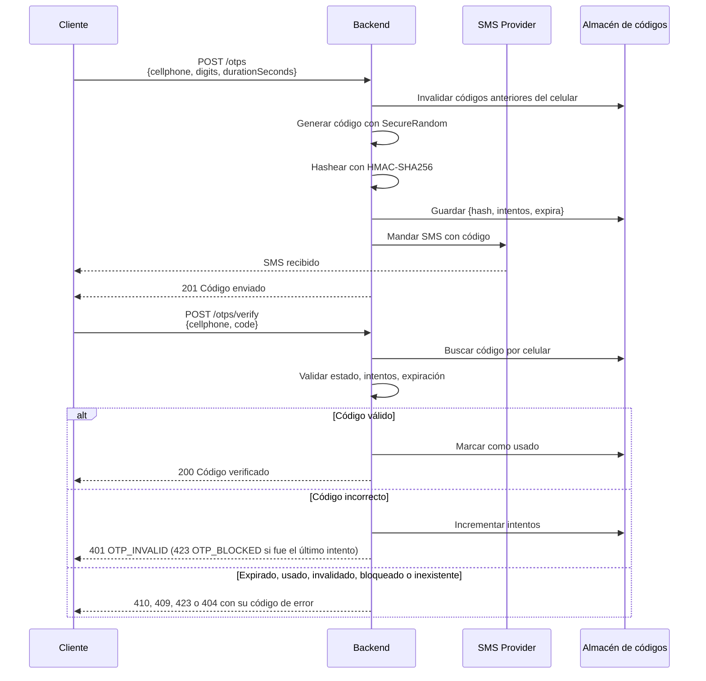
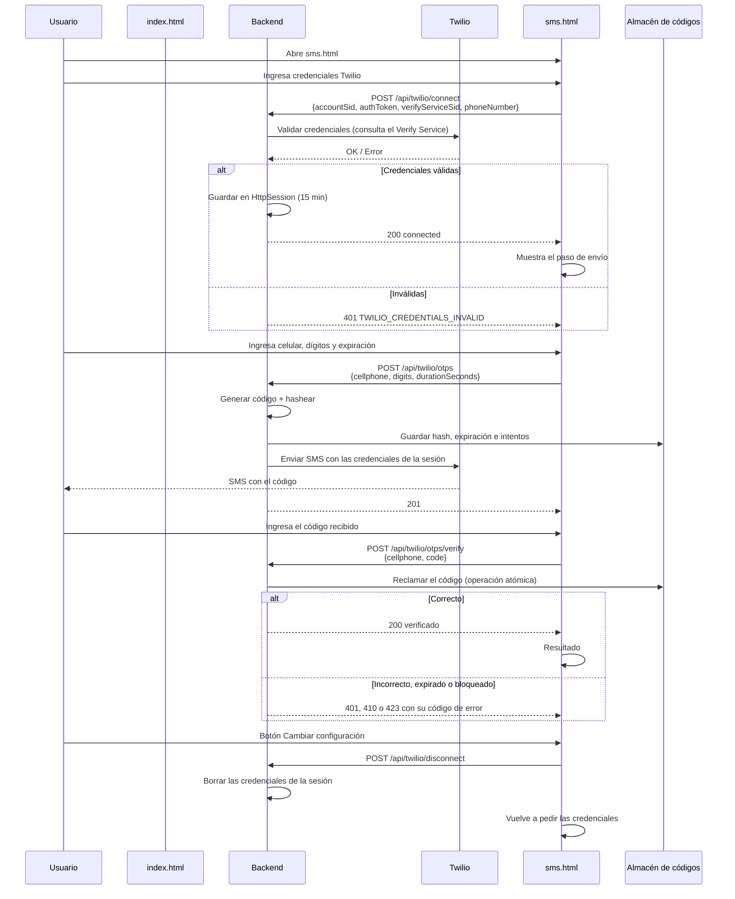
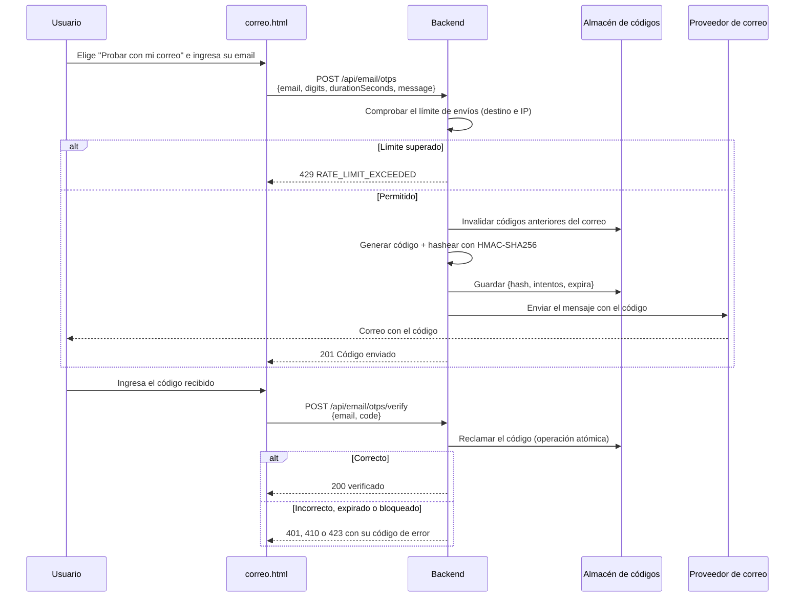

<h1 align="center">Un Solo Uso</h1>

<p align="center">
  Códigos de un solo uso por SMS o correo, con OTP, HOTP y TOTP
</p>

<p align="center">
  
  
  
  
</p>

Backend en Spring Boot que genera y verifica códigos de un solo uso con tres protocolos (OTP aleatorio, HOTP y TOTP). Los entrega por SMS o correo y los verifica de forma segura y atómica. El proveedor de SMS es intercambiable (consola, Twilio o Infobip) y el proyecto incluye una interfaz web y documentación interactiva con Swagger.

**Demo:** [otp-service-78yu.onrender.com](https://otp-service-78yu.onrender.com). Corre en el plan gratuito de Render: si estuvo inactivo, la primera carga puede tardar cerca de un minuto. Para enviar SMS hay que conectar una cuenta propia de Twilio.

## Tabla de Contenido

- [Descripción General](#descripción-general)
- [Características Principales](#características-principales)
- [OTP, HOTP y TOTP](#otp-hotp-y-totp)
- [Stack Tecnológico](#stack-tecnológico)
- [Arquitectura del Sistema](#arquitectura-del-sistema)
- [Módulos del Sistema](#módulos-del-sistema)
- [Documentación Detallada](#documentación-detallada)
- [Instalación y Configuración](#instalación-y-configuración)
- [Variables de Entorno](#variables-de-entorno)
- [Despliegue en Render](#despliegue-en-render)
- [Scripts Disponibles](#scripts-disponibles)
- [API Endpoints](#api-endpoints)
- [Flujos de Uso](#flujos-de-uso)
- [Limitaciones Conocidas](#limitaciones-conocidas)
- [Contribución](#contribución)

---

## Descripción General

Un Solo Uso es una API REST desarrollada con **Spring Boot** para verificar que alguien controla un celular o un correo. Primero se elige el canal (SMS o correo) y después el protocolo (OTP, HOTP o TOTP):

- El backend genera el código y decide si es válido. Con OTP guarda solo su hash; con HOTP y TOTP no guarda el código: lo recalcula a partir de un secreto cifrado.
- Un proveedor de SMS, intercambiable por configuración, solo se encarga de entregar el mensaje.
- Un mismo código solo puede verificarse una vez, aunque lleguen dos peticiones a la vez.
- La interfaz web permite probar el flujo completo por correo, sin ninguna cuenta, o por SMS conectando una cuenta propia de Twilio.

### Qué hace el backend y qué hace el proveedor de SMS

| Backend (Spring Boot) | Proveedor de SMS (Twilio o Infobip) |
|---|---|
| Genera el código con `SecureRandom` | Entrega el SMS al celular |
| Guarda su hash HMAC-SHA256 y su expiración | Cobra el envío a la cuenta conectada |
| Cuenta intentos, bloquea y marca el código como usado | |
| Verifica el código | |

El proveedor nunca sabe si un código es correcto. Más detalle en [PROVEEDORES_SMS.md](./docs/PROVEEDORES_SMS.md).

---

## Características Principales

### Generación y verificación de códigos
- Códigos de 4 a 10 dígitos (6 por defecto), generados con `SecureRandom`
- Duración configurable por petición, de 1 a 86.400 segundos (30 por defecto)
- Máximo de intentos por código (3 por defecto): el intento fallido que llega al máximo bloquea el código
- Cada código va ligado a un propósito (`LOGIN`, `REGISTER`, `PASSWORD_RECOVERY`, `PAYMENT_CONFIRMATION`): uno pedido para iniciar sesión no confirma un pago
- Generar un código nuevo invalida los anteriores del mismo destino y propósito
- Cada código se acepta una sola vez

### Seguridad
- Nunca se guarda el código, solo su hash HMAC-SHA256 con clave (`OTP_HASH_SECRET`)
- Verificación atómica (en memoria o en MongoDB): sin condiciones de carrera entre verificaciones simultáneas
- Validación del celular (formato peruano `+51 9XXXXXXXX`) y del correo electrónico
- Límite de envíos y, aparte, límite de verificaciones, ambos por destino y por IP (`429 RATE_LIMIT_EXCEEDED`)
- La IP del cliente la fija Tomcat (`RemoteIpValve`) confiando solo en proxies conocidos: un `X-Forwarded-For` inventado no crea identidades nuevas
- HOTP y TOTP se bloquean `OTP_LOCK_SECONDS` tras 3 fallos, y pedir otro código no levanta el bloqueo
- Con el perfil `prod` la aplicación no arranca sin `OTP_HASH_SECRET` y `OTP_SECRET_ENCRYPTION_KEY` propios, y el log no muestra códigos
- Las credenciales de Twilio viven solo en la memoria del servidor, ligadas a la sesión HTTP (15 minutos), y no se escriben en ninguna base de datos ni en el log
- El modo demo no puede combinarse con un proveedor de SMS real (la aplicación no arranca)

### Almacenamiento intercambiable
- En memoria por defecto: no necesita base de datos, los códigos se purgan al vencer su retención y hay un tope de códigos guardados
- MongoDB opcional con el perfil `mongo`, para que los códigos sobrevivan a un reinicio o para varias instancias

### Proveedores de SMS intercambiables
- `console`: escribe el mensaje en el log, sin cuentas ni costo (por defecto)
- `twilio`: envío con la cuenta de Twilio del servidor
- `infobip`: envío con Infobip
- Flujo web con la cuenta de Twilio del propio usuario, por sesión

### Correo electrónico
- Canal de envío por correo, sin cuentas para el visitante: escribe su email y recibe el código
- `console` (por defecto) escribe el correo en el log; `brevo` envía con la API HTTPS de Brevo (plan gratuito de 300 correos al día)
- No usa SMTP: los servicios gratuitos de Render bloquean los puertos 25, 465 y 587. Ver [CORREO.md](./docs/CORREO.md)

### Tres protocolos por cualquier canal
- OTP aleatorio, HOTP ([RFC 4226](https://www.rfc-editor.org/rfc/rfc4226)) y TOTP ([RFC 6238](https://www.rfc-editor.org/rfc/rfc6238)), elegibles al enviar el código
- Con HOTP y TOTP el servidor no guarda el código: guarda el secreto cifrado y lo recalcula al verificar
- HOTP no caduca por tiempo y acepta los códigos emitidos que aún no se usaron; TOTP cambia con cada ventana y repite código dentro de la misma

### Interfaz web incluida
- Pantalla de inicio con un tablero de aletas que muestra en vivo cómo cambian OTP, HOTP y TOTP, y dos caminos: correo (sin cuenta) y SMS (con la cuenta de Twilio del usuario)
- Una página por canal con el mismo flujo en tres pasos: elegir protocolo y enviar, verificar y resultado. En SMS, si no hay cuenta conectada, la misma página pide primero las credenciales de Twilio
- Un recuadro "¿Sabías que…?" explica qué cambia con cada protocolo
- El propósito del código (iniciar sesión, registro, recuperar acceso, confirmar un pago) define el texto del SMS, o se puede escribir un mensaje propio con `{code}` y `{seconds}`
- Cuenta regresiva del código y estados de error y de expiración
- HTML, CSS y JavaScript sin framework, servidos por Spring Boot

### API documentada
- Swagger UI y especificación OpenAPI generadas automáticamente
- Errores con código estable (`OTP_EXPIRED`, `OTP_BLOCKED`, ...) y estado HTTP coherente

### Arquitectura hexagonal
- Dominio sin dependencias de Spring, MongoDB ni proveedores de SMS
- El almacenamiento es un puerto con dos adaptadores: memoria y MongoDB
- El destino del código es un concepto general (`Destination`): celular o correo
- Agregar un proveedor de SMS es agregar una clase

---

## OTP, HOTP y TOTP

El **tipo de OTP** decide cómo se obtiene y se comprueba el código; **el canal** (SMS o correo) solo lo entrega. Lo que cambia entre tipos:

| | OTP aleatorio | HOTP | TOTP |
|---|---|---|---|
| Cómo se obtiene el código | Número aleatorio (`SecureRandom`) | `Truncar(HMAC-SHA1(secreto, contador)) mod 10^dígitos` · [RFC 4226](https://www.rfc-editor.org/rfc/rfc4226) | `HOTP(secreto, T)` con `T = ⌊hora Unix ÷ ventana⌋` · [RFC 6238](https://www.rfc-editor.org/rfc/rfc6238) |
| Qué guarda el servidor | El hash del código enviado | El secreto cifrado y el contador | El secreto cifrado y la última ventana usada |
| Cómo verifica | Compara con el hash guardado | Recalcula los últimos 10 contadores emitidos sin usar (`hmac.hotp-look-ahead`); nunca uno no emitido | Recalcula la ventana actual ± la tolerancia (`hmac.totp-tolerance-steps`, 1) |
| Qué lo invalida | El uso, el tiempo y pedir otro | El uso (suyo o de uno posterior) o quedar detrás de 10 más nuevos | El fin de su ventana y la tolerancia (30–60 s), y el uso |
| Pedir otro código | Invalida el anterior | Avanza el contador; los 10 más recientes siguen valiendo hasta que se usa uno posterior | En la misma ventana llega el mismo código |
| Canales | SMS y correo | SMS y correo | SMS y correo |

En HOTP y TOTP el servidor hace de dispositivo: calcula el código con el secreto y lo envía por SMS o correo. Es el mismo cálculo que hacen Google Authenticator y otras apps autenticadoras.

## Stack Tecnológico

### Backend
- **Framework:** Spring Boot 4.1.1
- **Lenguaje:** Java 21
- **Web:** Spring Web MVC
- **Validación:** Bean Validation (Jakarta)
- **Build:** Maven (wrapper incluido)

### Almacenamiento
- **Memoria** (por defecto): sin dependencias externas
- **MongoDB** (opcional) con Spring Data MongoDB

### Servicios Externos (opcionales)
- **Twilio:** SDK 13.0.1, API de mensajes
- **Infobip:** API REST, mediante `RestClient` de Spring

### Herramientas
- **Documentación de API:** springdoc-openapi 3.0.2 (Swagger UI)
- **Contenedores:** Docker y Docker Compose (imagen multi-etapa con Eclipse Temurin 21)
- **Frontend:** HTML5, CSS3 y JavaScript sin framework; fuentes de Google Fonts
- **Lombok:** solo en tiempo de compilación

---

## Arquitectura del Sistema

```
        Cliente (navegador · curl · Swagger UI)
                        │ HTTP/REST
                        ▼
┌───────────────────────────────────────────────────────┐
│ adapter/in/http                                       │
│  Controllers · DTOs HTTP · GlobalExceptionHandler     │
└───────────────────────┬───────────────────────────────┘
                        │ Command / Result
                        ▼
┌───────────────────────────────────────────────────────┐
│ application                                           │
│  GenerateOtpUseCase · VerifyOtpUseCase                │
│  Puertos: OtpPersistencePort · SmsSender ·            │
│           EmailSender · CodeHasherPort                │
└───────────────────────┬───────────────────────────────┘
                        │ implementan los puertos
                        ▼
┌───────────────────────────────────────────────────────┐
│ adapter/out                                           │
│  persistence · security (HMAC) · sms                  │
└───────────┬──────────────────────────┬────────────────┘
            ▼                          ▼
   Memoria · MongoDB     Consola · Twilio · Infobip

domain (Otp, Cellphone, OtpCode, ValidityWindow, excepciones)
lo usan todas las capas y no depende de ninguna.
```

La regla de dependencia es `adapter → application → domain`. El detalle de paquetes y decisiones está en [ARQUITECTURA.md](./docs/ARQUITECTURA.md).


---

## Módulos del Sistema

### Núcleo OTP
Generación y verificación de códigos.

**Características:**
- Código aleatorio de 4 a 10 dígitos
- Ventana de validez, contador de intentos y estado usado / invalidado
- Un código nuevo invalida los anteriores del celular

**Clases principales:** `GenerateOtpUseCaseImpl`, `VerifyOtpUseCaseImpl`, `Otp`, `OtpCode`, `Cellphone`, `ValidityWindow`, `VerificationStatus`

**Colección (modo MongoDB):** `otps`

---

### Persistencia
Almacenamiento de los códigos con operaciones atómicas, en memoria o en MongoDB según el perfil.

**Características:**
- `claimIfMatches` marca el código como usado solo si coincide, no expiró y quedan intentos
- `registerFailedAttempt` suma un intento fallido en una sola operación
- En memoria, un único lock protege el estado, purga los códigos vencidos y descarta los más antiguos al llegar al tope
- El modelo de dominio (`Otp`) está separado del documento de MongoDB (`OtpDocument`)

**Clases principales:** `InMemoryOtpPersistenceAdapter`, `OtpPersistenceAdapter`, `OtpRepository`, `OtpRepositoryImpl`, `OtpDocument`, `OtpPersistenceMapper`

---

### Seguridad
Protección del código guardado.

**Características:**
- Hash HMAC-SHA256 con clave configurable
- Aviso al arrancar si se usa la clave de desarrollo
- `DemoModeGuard` impide combinar el modo demo con un proveedor real

**Clases principales:** `CodeHasher`, `CodeHasherPort`, `DemoModeGuard`

---

### Envío de SMS
Entrega del mensaje con el proveedor elegido.

**Características:**
- Proveedor global elegido con `SMS_PROVIDER`
- Modo consola por defecto, sin cuentas
- Error `SMS_DELIVERY_FAILED` (502) si el proveedor falla

**Clases principales:** `SmsSender`, `ConsoleSmsSender`, `TwilioSmsSender`, `InfobipSmsSender`

---

### Correo
Entrega del código por email, sin cuentas para el visitante.

**Características:**
- Proveedor elegido con `EMAIL_PROVIDER`: `console` (por defecto) o `brevo`
- API HTTPS de Brevo, porque Render gratis bloquea SMTP
- Error `EMAIL_DELIVERY_FAILED` (502) si el proveedor falla, y `RATE_LIMIT_EXCEEDED` (429) si se supera el límite de envíos

**Clases principales:** `EmailOtpHttpAdapter`, `EmailSender`, `ConsoleEmailSender`, `BrevoEmailSender`, `SendRateLimiter`

---

### Twilio por sesión
Flujo de la interfaz web con la cuenta de Twilio del usuario.

**Características:**
- Conectar valida las credenciales contra Twilio
- Las credenciales se guardan 15 minutos en la sesión y se muestran enmascaradas
- Al conectar se consultan los números verificados de la cuenta y el envío queda limitado a ellos
- El envío usa las credenciales de la sesión, no las del servidor

**Clases principales:** `TwilioConnectHttpAdapter`, `TwilioOtpHttpAdapter`, `TwilioSessionService`, `TwilioSessionSmsSender`, `TwilioVerifyService`

---

### Manejo de errores
Excepciones de negocio traducidas a respuestas HTTP.

**Características:**
- Una excepción por regla (`OtpExpiredException`, `OtpBlockedException`, ...)
- Un único punto que decide el código HTTP: `GlobalExceptionHandler`
- Respuesta uniforme `{success, code, message}`

**Clases principales:** `OtpDomainException`, `GlobalExceptionHandler`

---

### Interfaz web
Cliente de demostración en `src/main/resources/static/`.

**Características:**
- `index.html`: tablero de OTP, HOTP y TOTP y acceso a los dos canales
- `correo.html` y `sms.html`: envío, verificación y resultado en tres pasos, una página por canal. `sms.html` además pide conectar la cuenta de Twilio; las dos comparten la lógica en `js/otp-flow.js` y solo cambian los campos y las llamadas propias de cada canal (`js/canal-correo.js`, `js/canal-sms.js`)
- `theme.css` es el sistema visual común; `board.css` y `style.css` son los estilos de la portada y de las páginas de canal
- El selector de propósito (iniciar sesión, registro, recuperar acceso, confirmar un pago) cambia el texto del SMS y los textos de la demo; también se puede escribir un mensaje propio. El backend valida el código igual en todos los casos

---

## Documentación Detallada

### Arquitectura
[**ARQUITECTURA.md**](./docs/ARQUITECTURA.md)
Estructura hexagonal del proyecto:
- Paquetes y regla de dependencia
- Manejo de errores
- Decisiones de diseño, limitaciones y deuda técnica

### Flujos
[**FLUJOS.md**](./docs/FLUJOS.md)
Diagramas complementarios a los [Flujos de Uso](#flujos-de-uso):
- Generar un código, paso a paso
- Verificar un código, con cada comprobación y su error
- Ciclo de vida de un código
- Qué proveedor envía cada flujo

### Base de Datos
[**BASE_DE_DATOS.md**](./docs/BASE_DE_DATOS.md)
Modelo de datos y almacenamiento:
- Modo memoria y modo MongoDB
- Campos de la colección `otps`
- Ciclo de vida de un código
- Operaciones atómicas
- Índices y purga por TTL
- Datos que se guardan

### API
[**API.md**](./docs/API.md)
Referencia de los endpoints:
- Campos, reglas, request y response de cada endpoint
- Flujo de Twilio por sesión
- Códigos de error y errores de formato

### Correo
[**CORREO.md**](./docs/CORREO.md)
Envío por correo electrónico:
- Por qué Brevo y no Gmail por SMTP
- Configuración paso a paso
- Límites y buenas prácticas

### Proveedores de SMS
[**PROVEEDORES_SMS.md**](./docs/PROVEEDORES_SMS.md)
Envío de mensajes:
- Qué hace el backend y qué hace el proveedor
- Consola, Twilio e Infobip
- Validaciones al arrancar y restricciones
- Cómo agregar un proveedor

---

## Instalación y Configuración

### Prerrequisitos

- Java 21
- Opcional: Docker, para levantar la aplicación con MongoDB mediante Docker Compose
- No hace falta instalar Maven: el repositorio incluye `mvnw`
- Opcional: una cuenta de Twilio o Infobip para enviar SMS reales

### Opción A. Ejecutar en local

```bash
git clone https://github.com/JoshRivas313/OTP-Service.git
cd OTP-Service
./mvnw spring-boot:run
```

En Windows: `mvnw.cmd spring-boot:run`.

Sin más configuración la aplicación guarda los códigos en memoria, no necesita ninguna base de datos y usa el proveedor `console`. Al reiniciarla se pierden los códigos pendientes.

Para guardarlos en MongoDB, levanta una instancia y activa el perfil `mongo`:

```bash
docker run -d -p 27017:27017 --name otp-mongo mongo:latest
SPRING_PROFILES_ACTIVE=mongo ./mvnw spring-boot:run
```

Con el perfil `mongo` la aplicación crea sola los índices, incluido el de purga por TTL.

### Opción B. Docker Compose

```bash
docker compose up --build
```

Levanta MongoDB y la aplicación con el perfil `mongo` y el proveedor `console`. Las credenciales de MongoDB y la clave de `docker-compose.yml` son solo para desarrollo local.

### Probar

- Interfaz web: `http://localhost:8080` (pide conectar una cuenta de Twilio, ver [Limitaciones Conocidas](#limitaciones-conocidas))
- Swagger UI: `http://localhost:8080/swagger-ui.html` (con la imagen Docker está deshabilitado salvo que definas `SWAGGER_ENABLED=true`; Docker Compose ya lo activa)
- Estado del servicio: `GET http://localhost:8080/health`

Sin ninguna cuenta se puede probar la API directamente. Con el proveedor `console`, el código aparece en el log de la aplicación:

```bash
curl -X POST http://localhost:8080/otps \
  -H "Content-Type: application/json" \
  -d '{"cellphone":"912345678","digits":6,"durationSeconds":60}'
```

En el log:

```
[DEV][SMS] para=*********678 mensaje="Tu código de verificación es 482913. Vence en 60 segundos."
```

Con Docker Compose: `docker compose logs -f app`. Luego, con ese código:

```bash
curl -X POST http://localhost:8080/otps/verify \
  -H "Content-Type: application/json" \
  -d '{"cellphone":"912345678","code":"482913"}'
```

---

## Variables de Entorno

La aplicación lee estas variables del entorno del sistema. **El archivo `.env` no se carga automáticamente**: `.env.example` solo lista las variables. Hay que definirlas en el shell, en la configuración de ejecución del IDE o en `docker-compose.yml`.

| Variable | Por defecto | Descripción |
|---|---|---|
| `SPRING_PROFILES_ACTIVE` | vacío (`prod` en la imagen Docker) | `mongo` activa el almacenamiento en MongoDB; sin él, los códigos se guardan en memoria. `prod` exige claves propias y apaga los códigos en el log. Se combinan con coma: `prod,mongo` |
| `MONGODB_URI` | `mongodb://localhost:27017/otp_service` | Conexión a MongoDB. Solo se lee con el perfil `mongo` |
| `OTP_HASH_SECRET` | `dev-only-secret-change-me` | Clave del HMAC-SHA256. Con el perfil `prod` es obligatoria y no puede ser el valor por defecto: la aplicación no arranca |
| `OTP_SECRET_ENCRYPTION_KEY` | clave de desarrollo | Clave AES-256 en Base64 (32 bytes) que cifra los secretos de HOTP y TOTP. Generala con `openssl rand -base64 32`. Si se pierde o se cambia, los secretos guardados dejan de servir y cada destino necesita un código nuevo. Con el perfil `prod` es obligatoria y no puede ser la de desarrollo |
| `OTP_DEMO_MODE` | `false` | Si es `true`, `POST /otps` devuelve el código en `demoCode`. No se puede combinar con `twilio` ni `infobip` |
| `SMS_PROVIDER` | `console` | `console`, `twilio` o `infobip` |
| `TWILIO_ACCOUNT_SID` | vacío | Obligatoria si `SMS_PROVIDER=twilio` |
| `TWILIO_AUTH_TOKEN` | vacío | Obligatoria si `SMS_PROVIDER=twilio` |
| `TWILIO_PHONE_NUMBER` | vacío | Número de Twilio remitente. Obligatoria si `SMS_PROVIDER=twilio` |
| `INFOBIP_BASE_URL` | vacío | Obligatoria si `SMS_PROVIDER=infobip` |
| `INFOBIP_API_KEY` | vacío | Obligatoria si `SMS_PROVIDER=infobip` |
| `INFOBIP_SENDER` | vacío | Obligatoria si `SMS_PROVIDER=infobip` |
| `EMAIL_PROVIDER` | `console` | `console` o `brevo` |
| `BREVO_API_KEY` | vacío | Clave de la API de Brevo. Obligatoria si `EMAIL_PROVIDER=brevo` |
| `EMAIL_SENDER_ADDRESS` | vacío | Correo remitente, validado en Brevo. Obligatoria si `EMAIL_PROVIDER=brevo` |
| `EMAIL_SENDER_NAME` | `Un Solo Uso` | Nombre que ve el destinatario como remitente |
| `OTP_RATE_LIMIT_PER_DESTINATION` | `5` | Envíos permitidos por celular o correo en la ventana. `0` desactiva el límite |
| `OTP_RATE_LIMIT_PER_IP` | `20` | Envíos permitidos por IP en la ventana. `0` desactiva el límite |
| `OTP_RATE_LIMIT_WINDOW_SECONDS` | `600` | Duración de la ventana de ambos límites (envíos y verificaciones) |
| `OTP_VERIFY_RATE_LIMIT_PER_DESTINATION` | `10` | Verificaciones permitidas por celular o correo en la ventana, correctas o no. `0` desactiva el límite |
| `OTP_VERIFY_RATE_LIMIT_PER_IP` | `30` | Verificaciones permitidas por IP en la ventana. `0` desactiva el límite |
| `OTP_LOCK_SECONDS` | `600` | Cuánto dura el bloqueo de HOTP y TOTP tras 3 fallos. Es independiente de la retención de datos |
| `OTP_LOG_CODES` | `true` (`false` con `prod`) | Si los proveedores de consola escriben el código en el log. Fuera de desarrollo solo se escribe `Código enviado a j***@gmail.com` |
| `SERVER_TOMCAT_REMOTEIP_INTERNAL_PROXIES` | redes privadas y localhost | Expresión regular con las IP de los proxies de confianza. Solo de ellos se lee `X-Forwarded-For`. Ver [IP del cliente](#ip-del-cliente) |
| `PORT` | `8080` | Puerto HTTP. Las plataformas como Render lo definen solas |
| `SESSION_COOKIE_SECURE` | `false` | Si es `true`, la cookie de sesión solo viaja por HTTPS. Actívalo al publicar |
| `OTP_LOCAL_API_ENABLED` | `true` | Si es `false`, se deshabilitan `POST /otps` y `POST /otps/verify`; quedan solo los endpoints de Twilio por sesión |
| `SWAGGER_ENABLED` | `true` | Si es `false`, se deshabilitan Swagger UI y `/v3/api-docs`. La imagen Docker lo trae en `false`; `docker-compose.yml` lo activa |
| `OTP_MEMORY_MAX_ENTRIES` | `10000` | Tope de códigos guardados en memoria; al llegar se descartan los más antiguos |

### IP del cliente

Los dos limitadores (`SendRateLimiter` y `VerifyRateLimiter`) cuentan por `HttpServletRequest.getRemoteAddr()`. Ese valor no sale de leer la cabecera a mano: lo fija Tomcat con `RemoteIpValve` (`server.forward-headers-strategy: native`).

```
CLIENTE ──► PROXY (Render) ──► SPRING BOOT (Tomcat)
            agrega la IP real    RemoteIpValve: si la conexión viene de un proxy de confianza,
            al final de          recorre X-Forwarded-For de derecha a izquierda y se queda con la
            X-Forwarded-For      primera IP que no es un proxy ──► getRemoteAddr() ──► limitadores
```

- Si la conexión **no** viene de un proxy de confianza, `X-Forwarded-For` se ignora y cuenta la IP de la conexión.
- Si viene de un proxy de confianza, lo que el cliente escribió a la izquierda de la cabecera se descarta: cuenta la IP que agregó el proxy.
- Los proxies de confianza se definen con `SERVER_TOMCAT_REMOTEIP_INTERNAL_PROXIES`. Por defecto son las redes privadas (10.x, 192.168.x, 172.16–31.x) y localhost.

La estrategia anterior (`framework`) tomaba el primer valor de la cabecera, que elige el cliente: con una IP falsa por petición el límite por IP no frenaba nada. `ClientIpHttpTest` prueba los dos casos y deja la estrategia anterior como control.

```bash
# Linux, macOS o Git Bash
export OTP_HASH_SECRET="una-clave-larga-y-aleatoria"
./mvnw spring-boot:run
```

```powershell
# PowerShell
$env:OTP_HASH_SECRET = "una-clave-larga-y-aleatoria"
.\mvnw.cmd spring-boot:run
```

Los parámetros del código se definen en `src/main/resources/application.yaml`:

| Propiedad | Valor | Descripción |
|---|---|---|
| `otp.digits` | `6` | Dígitos por defecto |
| `otp.duration-seconds` | `30` | Duración por defecto, en segundos |
| `otp.max-attempts` | `3` | Intentos fallidos antes de bloquear |
| `otp.retention-seconds` | `86400` | Segundos que se conserva un código tras expirar (en memoria lo purga la propia aplicación; en MongoDB, el índice TTL) |

`digits` y `durationSeconds` también se pueden enviar en cada petición.

---

## Despliegue en Render

La aplicación se despliega como un **Web Service con Docker** usando el `Dockerfile` del repositorio. Con el almacenamiento en memoria por defecto no hace falta ninguna base de datos.

1. En Render, crea un **New Web Service** y conecta el repositorio.
2. Elige **Language: Docker**. Render detecta el `Dockerfile` y toma el puerto de la variable `PORT`.
3. Define estas variables de entorno:

| Variable | Valor |
|---|---|
| `OTP_HASH_SECRET` | Una clave larga y aleatoria, por ejemplo la salida de `openssl rand -hex 32` |
| `OTP_SECRET_ENCRYPTION_KEY` | La salida de `openssl rand -base64 32`. No la cambies después: los secretos guardados de HOTP y TOTP dejarían de servir |
| `SESSION_COOKIE_SECURE` | `true` |
| `OTP_LOCAL_API_ENABLED` | `false` |

Para que el canal de correo envíe correos reales, agrega también estas variables (ver [CORREO.md](./docs/CORREO.md)); sin ellas el correo se escribe solo en el log:

| Variable | Valor |
|---|---|
| `EMAIL_PROVIDER` | `brevo` |
| `BREVO_API_KEY` | La clave de API de tu cuenta de Brevo. Guárdala solo en Render, nunca en el repositorio |
| `EMAIL_SENDER_ADDRESS` | El correo remitente que validaste en Brevo |

4. En **Health Check Path** pon `/health`.
5. Despliega. La interfaz web queda disponible en la URL que asigna Render.

La imagen Docker deshabilita Swagger UI por defecto (`SWAGGER_ENABLED=false`); para activarlo en un despliegue, define `SWAGGER_ENABLED=true`.

Con esta configuración el servicio público expone dos canales: el correo (sin cuentas) y el SMS por sesión, donde cada visitante conecta su propia cuenta de Twilio y los envíos salen de ella. **No definas `SMS_PROVIDER=twilio` con tus propias credenciales en el servidor público**, porque cualquiera podría generar SMS a cargo de tu cuenta.

En el plan gratuito de Render el servicio se suspende tras un rato sin tráfico y, al despertar, empieza con la memoria vacía: los códigos pendientes, los secretos de HOTP y TOTP y las sesiones de Twilio se pierden. Para conservarlos, usá el perfil `mongo`.

---

## Scripts Disponibles

```bash
# Desarrollo
./mvnw spring-boot:run              # Inicia la aplicación

# Compilación
./mvnw clean compile                # Compila
./mvnw clean package                # Genera el JAR en target/
java -jar target/otp-service-0.0.1-SNAPSHOT.jar

# Docker
docker compose up --build           # Levanta MongoDB y la aplicación (perfil mongo)
docker compose logs -f app          # Sigue el log (aquí aparecen los códigos en modo console)
docker compose down                 # Detiene los contenedores
docker compose down -v              # Detiene y borra los datos de MongoDB
```

---

## API Endpoints

Base URL: `http://localhost:8080`

Documentación interactiva: `http://localhost:8080/swagger-ui.html`

### OTP local

**POST /otps** — Generar código OTP

**Request**

```json
{
  "cellphone": "912345678",
  "digits": 6,
  "durationSeconds": 60
}
```

**Response `201`**

```json
{
  "success": true,
  "message": "Código enviado correctamente",
  "demoCode": null
}
```

**POST /otps/verify** — Verificar código

**Request**

```json
{
  "cellphone": "912345678",
  "code": "123456"
}
```

**Response `200`**

```json
{
  "success": true,
  "message": "Código verificado correctamente"
}
```

### OTP por correo

Mismos campos que `POST /otps`, con `email` en lugar de `cellphone` y un `message` opcional que debe contener `{code}`.

**POST /api/email/otps** — Generar y enviar el código

```json
{
  "email": "visitante@gmail.com",
  "type": "TOTP",
  "digits": 6,
  "durationSeconds": 30
}
```

`type` es `OTP` (por defecto), `HOTP` o `TOTP`, y existe en los tres endpoints de envío (`/otps`, `/api/email/otps`, `/api/twilio/otps`). En TOTP, `durationSeconds` es el tamaño de la ventana; en HOTP se ignora. La respuesta indica `type`, `expiresInSeconds` (ausente en HOTP, que no caduca por tiempo) y `counter` (HOTP) o `timeStep` (TOTP).

**POST /api/email/otps/verify** — Verificar el código.

```json
{
  "email": "visitante@gmail.com",
  "type": "TOTP",
  "code": "123456"
}
```

Al verificar hay que mandar el mismo `type` con el que se envió el código.

### OTP con Twilio por sesión

**POST /api/twilio/connect** — Conectar cuenta Twilio

**Request**

```json
{
  "accountSid": "ACxxxxxxxxxxxxxxxxxxxxxxxxxxxxxxxx",
  "authToken": "xxxxxxxxxxxxxxxxxxxxxxxxxxxxxxxx",
  "verifyServiceSid": "VAxxxxxxxxxxxxxxxxxxxxxxxxxxxxxxxx",
  "phoneNumber": "+15017122661"
}
```

**Response `200`**

```json
{
  "connected": true,
  "maskedCredentials": "AC1234···abcd / verify VA5678···efgh"
}
```

**GET /api/twilio/status** — Estado de la conexión

**Response `200`**

```json
{
  "connected": false,
  "maskedCredentials": null
}
```

**POST /api/twilio/disconnect** — Desconectar cuenta Twilio

**Response `200`**

```json
{
  "connected": false,
  "maskedCredentials": null
}
```

**POST /api/twilio/otps** — Generar código OTP con la cuenta de la sesión

**Request**

```json
{
  "cellphone": "912345678",
  "digits": 6,
  "durationSeconds": 60
}
```

**Response `201`**

```json
{
  "success": true,
  "message": "Código enviado correctamente",
  "demoCode": null
}
```

**POST /api/twilio/otps/verify** — Verificar código

**Request**

```json
{
  "cellphone": "912345678",
  "code": "123456"
}
```

**Response `200`**

```json
{
  "success": true,
  "message": "Código verificado correctamente"
}
```

### Error

Los errores de negocio y de validación comparten este formato:

**Response `401`** (ejemplo: código incorrecto)

```json
{
  "success": false,
  "code": "OTP_INVALID",
  "message": "El código es incorrecto (intento 1 de 3)"
}
```

**Documentación completa:** [API.md](./docs/API.md)

---

## Flujos de Uso

### Flujo 1: Generación Local (Motor Interno)



**Cuándo usar**: pruebas de la API, demo local y cuando no se tiene una cuenta de Twilio. Con el proveedor `console` el código aparece en el log de la aplicación en lugar de llegar por SMS.

### Flujo 2: Twilio por Sesión



**Cuándo usar**: probar el flujo completo con SMS reales desde la interfaz web, con la cuenta de Twilio propia. Twilio solo valida las credenciales y entrega el SMS; el código lo genera y lo verifica el backend.

### Flujo 3: Correo



**Cuándo usar**: probar el flujo completo sin ninguna cuenta. El backend hace exactamente lo mismo que con SMS; solo cambia el canal de entrega.


## Limitaciones Conocidas

- **Los celulares son solo peruanos.** Se acepta `9XXXXXXXX` o `+519XXXXXXXX`. Los correos pueden ser de cualquier dominio.
- **El SMS de la interfaz web exige conectar una cuenta de Twilio.** El canal de correo no necesita ninguna cuenta.
- **Con el almacenamiento en memoria, un reinicio borra los códigos pendientes y las sesiones de Twilio.** Además, la memoria no se comparte entre instancias: para varias réplicas hay que usar el perfil `mongo`.
- **En memoria hay un tope de códigos** (`OTP_MEMORY_MAX_ENTRIES`). Al llegar, se descartan los más antiguos, incluso si aún estaban vigentes.
- **La API no tiene autenticación.** Sí hay límites de envíos y de verificaciones por destino y por IP, pero no reemplazan a la autenticación: no publiques `SMS_PROVIDER=twilio` ni `infobip` en internet, porque cualquiera podría generar SMS a cargo de esa cuenta. Para una instancia pública usa `OTP_LOCAL_API_ENABLED=false`. En el canal de correo, el límite y el tope diario de Brevo acotan el abuso.
- **Los errores de formato no dicen qué campo falló.** Un celular, un código, un `type` o un `purpose` mal formados responden `400 VALIDATION_ERROR` con un mensaje genérico.
- **El OTP aleatorio da 3 intentos nuevos con cada código nuevo.** A diferencia de HOTP y TOTP, no hay bloqueo por destino: lo acotan el límite de envíos (5 por destino cada 10 min) y el de verificaciones (10 por destino cada 10 min).
- **Los límites viven en la memoria de cada instancia.** Con varias réplicas, cada una cuenta por su lado.
- **Solo se envía a los números verificados de la cuenta de Twilio conectada.** Al conectar, el servicio consulta a Twilio qué números tiene verificados la cuenta (siempre en las cuentas de prueba) y solo permite enviar a esos; otro destino responde `403 DESTINATION_NOT_VERIFIED`. Una cuenta de pago sin números verificados puede enviar a cualquier celular peruano.

---

## Contribución

### Flujo de trabajo

1. Crear una rama desde `main`: `feature/...` o `fix/...`
2. Hacer commits descriptivos
3. Comprobar que compila: `./mvnw clean compile`
4. Abrir un Pull Request a `main` explicando el cambio

### Convenciones

- **Commits:** Conventional Commits (`feat:`, `fix:`, `docs:`, `refactor:`, `chore:`)
- **Nombres:** `camelCase` para variables y métodos, `PascalCase` para clases
- **Capas:** `domain` no importa `application` ni `adapter`; `application` no importa `adapter`
- **Tiempo:** usar el `Clock` inyectado, nunca `Instant.now()`
- **Proveedor de SMS nuevo:** una clase que implemente `SmsSender` (ver [PROVEEDORES_SMS.md](./docs/PROVEEDORES_SMS.md#agregar-un-proveedor))

---

## Licencia

MIT. Ver [LICENSE](./LICENSE).

---

## Autor

[Jose Hurtado Rivas](https://www.linkedin.com/in/jose-hurtado-rivas-8150b0231/)

## Soporte

Dudas o problemas: [GitHub Issues](https://github.com/JoshRivas313/OTP-Service/issues)

---

**Versión:** 0.0.1-SNAPSHOT
**Última actualización:** 1 de octubre de 2026
