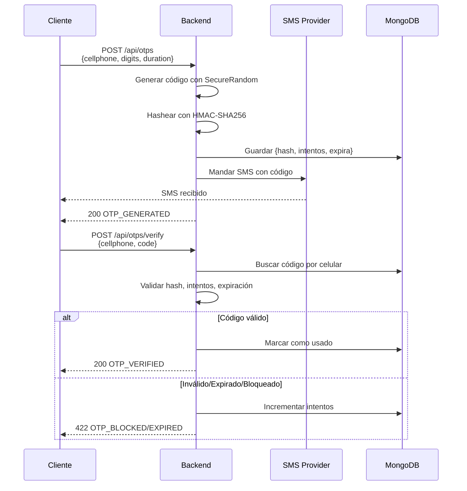
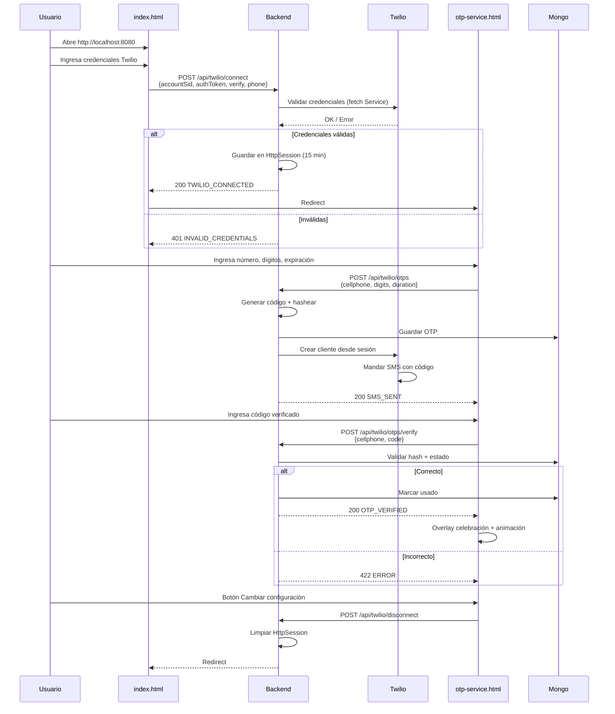

# OTP Service

Servicio de autenticación por código de un solo uso (OTP) con generación local y soporte para Twilio Verify. Códigos hasheados con HMAC-SHA256, validación E.164 de teléfonos, y UI sin CORS incluida.

## Tabla de Contenidos

- [Descripción General](#descripción-general)
- [Características Principales](#características-principales)
- [Stack Tecnológico](#stack-tecnológico)
- [Arquitectura del Sistema](#arquitectura-del-sistema)
- [Módulos Principales](#módulos-principales)
- [Instalación Rápida](#instalación-rápida)
- [Configuración](#configuración)
- [Scripts Disponibles](#scripts-disponibles)
- [API Endpoints](#api-endpoints)
- [Flujos de Uso](#flujos-de-uso)
- [Troubleshooting](#troubleshooting)
- [Testing](#testing)
- [Contribución](#contribución)

## Descripción General

OTP Service es una API REST construida con Spring Boot que proporciona dos métodos de generación y validación de códigos de un solo uso:

1. **Generación Local** — MongoDB + HMAC-SHA256, control total de dígitos y expiración
2. **Twilio Verify** — Integración con API de Twilio, gestión de credenciales por sesión

La aplicación incluye:
- UI embebida sin dependencias externas (servida por Spring Boot)
- Progress indicator visual en 3 pasos (generado → escribiendo → verificado)
- Sesiones de 15 minutos para credenciales de Twilio
- Bloqueo automático después de N intentos fallidos
- Purga automática de códigos expirados en Mongo
- Documentación interactiva con Swagger/OpenAPI

## Características Principales

**Generación Dual de OTP**
- Motor local con HMAC-SHA256: personalización de dígitos (4-10) y expiración (1s - 1 día)
- Twilio Verify: validación a través de API oficial, configuración en dashboard de Twilio

**Seguridad**
- Códigos nunca persistidos en texto plano, solo hash HMAC
- Validación E.164 de números telefónicos
- Bloqueo tras N intentos fallidos configurables
- Sesión timeout automático (15 minutos inactividad)
- Filtro HTTP obligatorio (`TwilioOnboardingFilter`) para acceso a /otp-service.html

**UI Interactiva**
- Pantalla de conexión Twilio (index.html) → session-protected OTP flow (otp-service.html)
- Progress bar visual con 3 estados: generado → escribiendo → verificado
- Overlay de celebración con animación SVG y partículas
- Responsive (360px - 1440px), respeta prefers-reduced-motion

**Monitoreo**
- TTL index en Mongo (`purgeAt`) para limpieza automática
- Logging de intentos fallidos y bloqueos
- Endpoints de status y validación de credenciales

## Stack Tecnológico

**Backend**
- Framework: Spring Boot 4.1.1
- Lenguaje: Java 21
- Build: Maven 3.8+

**Base de Datos**
- Documento: MongoDB 4.4+
- Collections: `otp_codes`, `verification_attempts`

**Servicios Externos**
- Twilio SDK: Verify API + Messaging API

**Frontend**
- HTML5, CSS3 (custom properties para dark theme)
- Vanilla JavaScript (sin frameworks)

**Documentación**
- springdoc-openapi 3.0.2 (Swagger/OpenAPI)

## Arquitectura del Sistema

```
┌─────────────────────────────────────────┐
│          Cliente / Navegador             │
│  index.html (Conexión Twilio)            │
│  otp-service.html (Flujo OTP)            │
└────────────────┬────────────────────────┘
                 │ HTTP/REST
                 ▼
┌─────────────────────────────────────────┐
│       Spring Boot Application            │
│  8080 (Controllers + Filters)            │
└────────────────┬────────────────────────┘
                 │
        ┌────────┼────────────┐
        │        │            │
        ▼        ▼            ▼
    ┌────────────────┐  ┌──────────────┐
    │   Services     │  │   Filters    │
    │ - OtpService   │  │   - Auth     │
    │ - TwilioOtpSrv │  │   - Twilio   │
    │ - SmsSender(s) │  │     Onboard  │
    └────────┬───────┘  └──────────────┘
             │
             ▼
    ┌─────────────────┐
    │  MongoDB        │
    │ - otp_codes     │
    │ - attempts      │
    └─────────────────┘

    HttpSession (Twilio Credentials)
    └─ TwilioCredentials { accountSid, authToken, verifyServiceSid, phoneNumber }
```

## Módulos Principales

**OTP Local Module** (`com.otpservice.otp.service`)
- `OtpService`: Interfaz central de generación y validación
- `OtpServiceImpl`: Lógica con Mongo + HMAC, inyección de SmsSender
- `OtpCode`: Value Object, genera códigos con SecureRandom
- `ValidityWindow`: Value Object, verifica expiración sin state mutable
- `VerificationStatus`: Value Object, cuenta intentos y detecta bloqueos

**Twilio Module** (`com.otpservice.otp.sms.twilioconnect`)
- `TwilioOtpService`: Interfaz para flujo Twilio Verify
- `TwilioOtpServiceImpl`: Delegación a OtpService + Twilio SDK
- `TwilioSessionSmsSender`: Manda SMS usando credenciales de sesión
- `TwilioSessionService`: Manejo de credenciales en HttpSession
- `TwilioVerifyService`: Validación de credenciales contra Twilio

**Configuration**
- `OpenApiConfig`: Swagger/OpenAPI metadata
- `TwilioOnboardingFilter`: Redirige a /index.html si no hay sesión Twilio

**SmsSender Implementations**
- `ConsoleSmsSender`: Imprime en stdout (default)
- `TwilioSmsSender`: SMS global usando credenciales del proyecto
- `InfobipSmsSender`: SMS con Infobip

## Instalación Rápida

**Requisitos Previos**
- Java 21+
- Maven 3.8+
- MongoDB 4.4+ (local en puerto 27017 o URL en variable de entorno)
- Cuenta de Twilio (opcional, trial gratuita disponible)

**1. Clonar y configurar**

```bash
git clone <repository-url>
cd Proyect-OTP-Portfolio
cp .env.example .env
```

**2. Completar .env**

```bash
MONGODB_URI=mongodb://localhost:27017/otp_service
TWILIO_ACCOUNT_SID=your-account-sid
TWILIO_AUTH_TOKEN=your-auth-token
TWILIO_VERIFY_SERVICE_SID=your-verify-service-sid
TWILIO_PHONE_NUMBER=+15017122661
OTP_HASH_SECRET=your-secret-key-min-32-chars
```

**3. Levantar MongoDB (Docker)**

```bash
docker run -d -p 27017:27017 --name otp-mongo mongo:latest
```

**4. Iniciar la aplicación**

```bash
./mvnw spring-boot:run
```

Abrí `http://localhost:8080` en el navegador.

## Configuración

### Variables de Entorno

```properties
# MongoDB
MONGODB_URI=mongodb://localhost:27017/otp_service

# OTP Local
OTP_HASH_SECRET=tu-clave-secreta-minimo-32-caracteres
OTP_DIGITS=6
OTP_EXPIRATION_SECONDS=300
OTP_MAX_ATTEMPTS=3
OTP_DEMO_MODE=false

# Twilio (credenciales globales para SmsSender)
TWILIO_ACCOUNT_SID=
TWILIO_AUTH_TOKEN=
TWILIO_VERIFY_SERVICE_SID=
TWILIO_PHONE_NUMBER=

# Infobip (alternativa a Twilio)
INFOBIP_API_KEY=
INFOBIP_BASE_URL=https://api.infobip.com

# SMS Provider
SMS_PROVIDER=console  # console, twilio, infobip

# Session
SERVER_SESSION_TIMEOUT_MINUTES=15

# Swagger
SPRINGDOC_API_DOCS_ENABLED=true
SPRINGDOC_SWAGGER_UI_ENABLED=true

# App
SERVER_PORT=8080
```

Ver `.env.example` para descripción completa de cada variable.

## Scripts Disponibles

```bash
# Desarrollo
./mvnw spring-boot:run                    # Inicia con hot-reload

# Compilación y Build
./mvnw clean compile                      # Compila
./mvnw clean package                      # Build JAR

# Testing
./mvnw test                               # Ejecuta todos los tests
./mvnw test -Dtest=NombreClaseTest        # Test específico

# Limpieza
./mvnw clean                              # Limpia target/
```

## API Endpoints

Base URL: `http://localhost:8080`

Documentación interactiva: `http://localhost:8080/swagger-ui.html`

### OTP Local (Motor interno)

**POST /api/otps** — Generar código OTP

```json
{
  "cellphone": "+519876543210",
  "digits": 6,
  "durationSeconds": 300
}
```

Response: `{ "message": "Código generado", "code": "OTP_GENERATED" }`

**POST /api/otps/verify** — Validar código

```json
{
  "cellphone": "+519876543210",
  "code": "123456"
}
```

Response: `{ "message": "Código verificado", "code": "OTP_VERIFIED" }`

### Twilio (Flujo por sesión)

**POST /api/twilio/connect** — Conectar cuenta Twilio

```json
{
  "accountSid": "ACxxxxxxxxxxxxx",
  "authToken": "your-auth-token",
  "verifyServiceSid": "VAxxxxxxxxxxxxx",
  "phoneNumber": "+15017122661"
}
```

Response: `{ "message": "Conectado", "code": "TWILIO_CONNECTED" }`

**GET /api/twilio/status** — Verificar si hay sesión activa

Response: `{ "connected": true, "accountSid": "ACxxxx" }`

**POST /api/twilio/otps** — Generar OTP (credenciales de sesión)

```json
{
  "cellphone": "+519876543210",
  "digits": 6,
  "durationSeconds": 300
}
```

**POST /api/twilio/otps/verify** — Validar código

```json
{
  "cellphone": "+519876543210",
  "code": "123456"
}
```

**POST /api/twilio/disconnect** — Limpiar sesión

Response: `{ "message": "Desconectado" }`

## Flujos de Uso

### Flujo 1: Generación Local (Motor Interno)



**Cuándo usar**: Tests, demo local, cuando no tenés Twilio.

### Flujo 2: Twilio Verify (Por Sesión)



**Cuándo usar**: Producción, control total de dígitos/expiración, múltiples usuarios simultáneamente.

### Modos de Operación

**Modo Demo** (`OTP_DEMO_MODE=true`)
- POST `/api/otps` devuelve el código en la response (además de mandar SMS)
- UI lo muestra para pruebas sin acceso al log del servidor
- La app rechaza si se combina con SMS_PROVIDER=twilio/infobip

**Modo Producción** (`OTP_DEMO_MODE=false`)
- Códigos nunca se devuelven en respuestas
- Solo el cliente que recibe el SMS lo sabe
- Logs del servidor no exponen códigos

## Troubleshooting

**"No se conecta a MongoDB"**
- Verificá que MongoDB esté corriendo: `docker ps | grep mongo`
- Verificá MONGODB_URI en .env (default: `mongodb://localhost:27017/otp_service`)

**"Código generado pero no llega SMS"**
- Si SMS_PROVIDER=console: el código está en la terminal donde corrés la app
- Si SMS_PROVIDER=twilio: verificá credenciales y que el número destino esté verificado en Twilio trial
- Verificá TWILIO_PHONE_NUMBER tiene formato E.164 (ej: `+15017122661`)

**"No me deja acceder a /otp-service.html"**
- Necesitas conectarte primero en `/index.html`
- La sesión expira después de 15 minutos de inactividad
- El filtro `TwilioOnboardingFilter` redirige si no hay credenciales en sesión

**"POST /api/twilio/connect falla con 422"**
- Verificá que los 4 campos (accountSid, authToken, verifyServiceSid, phoneNumber) estén presentes
- Verificá format E.164 en phoneNumber (empieza con + y tiene 6-15 dígitos)

**"Código bloqueado después de N intentos"**
- Por defecto son 3 intentos fallidos (`OTP_MAX_ATTEMPTS=3`)
- Espera a que expire el TTL (OTP_EXPIRATION_SECONDS) o genera uno nuevo

## Testing

```bash
./mvnw test
```

Resultado esperado: **39/39 tests passing**

Cobertura:
- `OtpServiceImplTest`: Lógica de generación, validación, intentos
- `TwilioOtpServiceImplTest`: Mock de OtpService y SmsSender
- `TwilioSessionServiceTest`: Gestión de credenciales en sesión
- `TwilioOnboardingFilterTest`: Redireccionamiento y filtrado
- Value Object tests: Cellphone, OtpCode, ValidityWindow, VerificationStatus

## Contribución

**Branch Strategy**
- `main`: código en producción
- `feature/*`: nuevas features
- `fix/*`: fixes

**Commit Convention**
```
feat: agregar indicador de progreso visual
fix: validacion de E.164 en conexion Twilio
docs: actualizar README con flujo Twilio
chore: actualizar dependencias
```

**Antes de pushear**
```bash
./mvnw clean test    # Todos los tests pasan
./mvnw compile       # Compila sin warnings
```

**Code Style**
- camelCase: variables, métodos
- PascalCase: clases
- UPPER_SNAKE_CASE: constantes
- Value Objects cuando hay validación de negocio
- Métodos testables (sin Instant.now() directo)

## Licencia

MIT

## Autores

Creado con Spring Boot, MongoDB y Twilio SDK.

---

**Documentación Swagger**: [http://localhost:8080/swagger-ui.html](http://localhost:8080/swagger-ui.html)

**Última actualización**: 2026-09-24

**Versión**: 0.0.1
