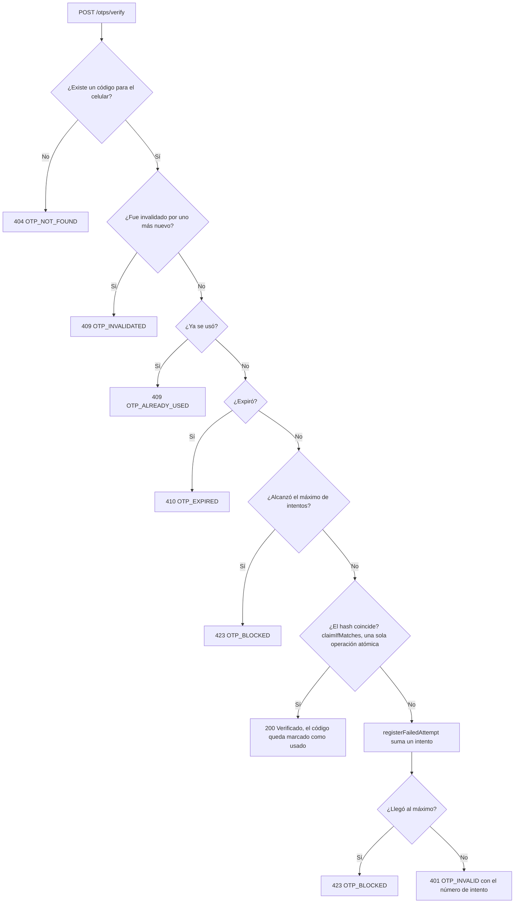
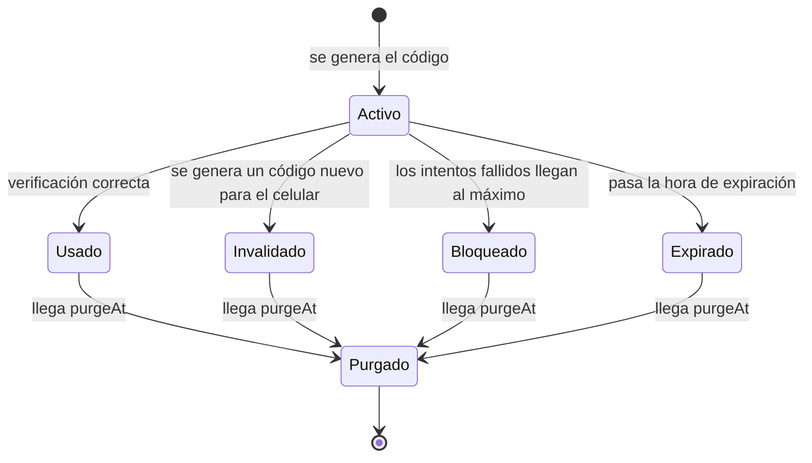
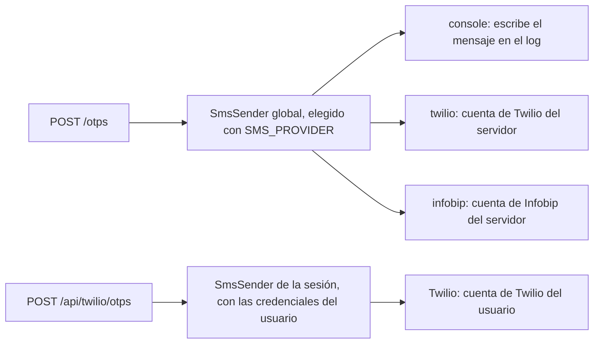

# Flujos

Diagramas complementarios a los dos flujos de uso del README: [Flujo 1: Generación Local](../README.md#flujo-1-generación-local-motor-interno) y [Flujo 2: Twilio por Sesión](../README.md#flujo-2-twilio-por-sesión).

## Contenido

- [Generar un código, paso a paso](#generar-un-código-paso-a-paso)
- [Verificar un código](#verificar-un-código)
- [Ciclo de vida de un código](#ciclo-de-vida-de-un-código)
- [Qué proveedor envía cada flujo](#qué-proveedor-envía-cada-flujo)

---

## Generar un código, paso a paso

`POST /otps` y `POST /api/twilio/otps` usan el mismo caso de uso (`GenerateOtpUseCase`); solo cambia el `SmsSender` que recibe.

1. Invalida los códigos anteriores del mismo celular que no estén usados ni invalidados.
2. Genera el código (`OtpCode.generate`, `SecureRandom`).
3. Calcula el hash con HMAC-SHA256 y la clave `OTP_HASH_SECRET`.
4. Guarda el `Otp` con su ventana de validez y `purgeAt = expiresAt + retención`.
5. Envía el mensaje con el `SmsSender` correspondiente.
6. Devuelve `demoCode` solo si `OTP_DEMO_MODE` está activo.

---

## Verificar un código

`POST /otps/verify` y `POST /api/twilio/otps/verify`.

Las comprobaciones se hacen sobre el código más reciente del celular. El intento fallido que alcanza el máximo (3 por defecto) ya responde `423`.

---

## Ciclo de vida de un código

No hay un campo de estado: el estado se deduce de los datos (ver [BASE_DE_DATOS.md](./BASE_DE_DATOS.md#ciclo-de-vida-de-un-código)).

La purga la hace la propia aplicación al guardar códigos nuevos (modo memoria) o el índice TTL de `purgeAt` (perfil `mongo`). Ver [BASE_DE_DATOS.md](./BASE_DE_DATOS.md#índices).

---

## Qué proveedor envía cada flujo

Más detalle en [PROVEEDORES_SMS.md](./PROVEEDORES_SMS.md).
